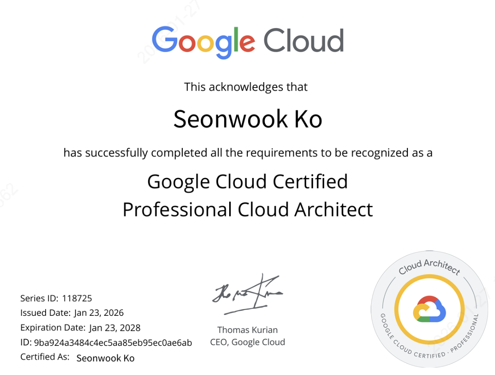

## 취득 배경
Google Cloud Partner Skills 실습을 하면서 프로젝트 내에서 자주 활용하는 GCS, BigQuery, CloudSQL 외에도 여러 GCP 서비스들을 익히고 이를 활용한 아키텍처 사례들을 알아보고 싶어 준비하게 되었습니다.

## 시험 개요
다음은 Cloud Architect 시험의 출제 항목 및 구성 비율에 대한 설명입니다.

기존 Data Engineer 시험과 달랐던 점은 Case studies 유형이 추가된 점입니다. Case studies에서는 흔히 볼 수 있는 산업군에서의 원하는 Solution Concept을 기조로 현재의 기술적 환경에서 요구하는 비즈니스 및 기술적 사항들을 GCP 서비스들을 활용하여 어떻게 최적화 시키고 비용 효율화를 이룰 수 있는 지 묻는 문제들이 나옵니다.

## 학습 방법
이론의 경우 모르는 서비스에 대해서는 직접 검색하거나 Docs를 활용하였고, 실습의 경우는 Google Skills for Partners의 세션들을 활용했습니다.

- Google Skills for Partners
  - https://partner.skills.google/

서비스에 대한 자세한 내용은 언제나 해당 CSP의 Docs를 참조하면 될 것 같습니다.
- Compute Engine(가상 머신)
  - https://cloud.google.com/compute/docs?hl=ko
- Google Kubernetes Engine(GKE, 컨테이너 오케스트레이션)
  - https://cloud.google.com/kubernetes-engine/docs?hl=ko
- Cloud Run(서버리스 컨테이너)
  - https://cloud.google.com/run/docs?hl=ko
- Cloud Storage(객체 스토리지)
  - https://cloud.google.com/storage/docs?hl=ko
- IAM(Identity and Access Management, 권한 관리)
  - https://cloud.google.com/iam/docs?hl=ko
- VPC(Virtual Private Cloud, 네트워크 인프라)
  - https://cloud.google.com/vpc/docs?hl=ko
- Cloud Load Balancing(부하 분산)
  - https://cloud.google.com/load-balancing/docs?hl=ko
- Pub/Sub(비동기 메시징/이벤트 스트리밍)
  - https://cloud.google.com/pubsub/docs?hl=ko
- Cloud Operations Suite(구 Stackdriver, 모니터링 및 로깅)
  - https://cloud.google.com/stackdriver/docs?hl=ko
- Cloud Build(CI/CD 파이프라인)
  - https://cloud.google.com/build/docs?hl=ko
- App Engine(PaaS, 서버리스 애플리케이션 플랫폼)
  - https://cloud.google.com/appengine/docs?hl=ko
- Cloud Functions(이벤트 기반 서버리스 함수)
  - https://cloud.google.com/functions/docs?hl=ko
- Cloud VPN(공용 인터넷 기반 하이브리드 연결)
  - https://cloud.google.com/vpn/docs?hl=ko
- Cloud Interconnect(전용 회선 기반 고대역폭 하이브리드 연결)
  - https://cloud.google.com/interconnect/docs?hl=ko
- Cloud KMS(Key Management Service, 암호화 키 관리)
  - https://cloud.google.com/kms/docs?hl=ko
- Secret Manager(API 키, 패스워드 등 민감 정보 관리)
  - https://cloud.google.com/secret-manager/docs?hl=ko
- Storage Transfer Service(데이터 이전 및 백업 자동화)
  - https://cloud.google.com/storage-transfer/docs?hl=ko
- Vertex AI(통합 AI/ML 플랫폼 - 최신 시험 트렌드)
  - https://cloud.google.com/vertex-ai/docs?hl=ko

추가적으로 [Udemy](https://www.udemy.com/course/google-cloud-professional-cloud-architect-certification/) 강의와 Examtopics의 기출 문제도 같이 활용했습니다.

## 합격 후기

Exam Guide에서 실제로 시험에 출제되는 Case Study에 대한 내용을 미리 볼 수 있어 선지의 기술적 구성 요소들에 대해 시간적으로 충분히 고민할 수 있었습니다. 

문제 상황에 따른 최적의 GCP 서비스 구성 사례에 대해서는 Examtopics 내의 문제들을 통해 충분히 대비하였습니다. 

해당 시험은 크게 5개의 섹션에 대한 평가를 바탕으로 50문제 중 약 40문제(80%) 이상 맞춰야 Pass 할 수 있습니다.

1. Designing and planning a cloud solution architecture(클라우드 솔루션 아키텍처 설계 및 계획) 25%
2. Managing and provisioning a cloud solution infrastructure(클라우드 솔루션 인프라 관리 및 프로비저닝) 17.5%
3. Designing for security and compliance(보안 및 규정 준수를 고려한 설계) 17.5%
4. Analyzing and optimizing technical and business processes(기술 및 비즈니스 프로세스 분석 및 최적화) 15%
5. Managing implementation(구현 관리) 12.5%
