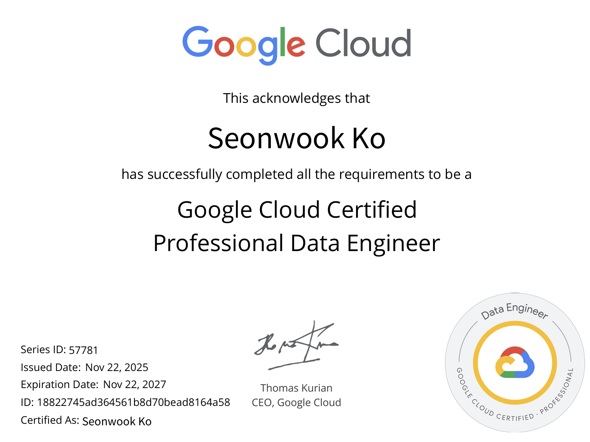

## 취득 배경
현재 프로젝트에서 데이터 플랫폼을 구축, 운영하게 되면서 Bigquery 기반의 스크립트를 많이 접하게 되었습니다. 이전 프로젝트에서는 Hive, Trino(Presto)를 기반으로 ELT 파이프라인을 많이 설계했었는데 Bigquery와의 유의미한 차이는 동적 쿼리, 즉 프로시저의 사용이 불가능하다는 것이였습니다. Bigquery 내에서 쿼리를 짜면서 데이터 파이프라인 뿐만 아니라 시스템 간 데이터 in/out을 검증하는 부분에 있어서도 편리함을 느낄 수 있었습니다. 

자연스럽게 Bigquery 뿐만 아니라 프로젝트의 전체적인 데이터 아키텍처의 기반이 GCP 서비스를 통해 구현되어 있어 GCP 서비스들에 대한 이해도와 사용하는 부분에 있어 어느정도의 이해도가 필요하다 생각하여 현재 쓰고 있는 Bigquery와 Data Enginner 업무에 가장 관련있는 Professional Data Engineer Certification 자격증을 준비하게 되었습니다. 

## 시험 개요
AWS와 다르게 시험의 한국어 지원이 없기 때문에 Exam Guide 또한 영어로 확인할 수 있었습니다. 그래도 업무를 함에 있어 많이 사용하는 용어라 준비하는데 어려움은 없었습니다. Exam Guide 내 섹션별 점수 비율 및 출제 내용이 명시되어 있기 때문에 해당 자료를 활용하여 준비하였습니다. 

## 학습 방법
현재 재직중인 회사가 Google Cloud와 파트너 관계이기 때문에 Google Cloud의 Partner Exchange에서 제공해주는 자료들을 많이 활용했습니다. Google Skills는 일반 사용자도 필요한 교육 자료를 활용할 수 있지만 Partner의 경우 일반사용자와 다르게 크레딧, 무료 바우처 등과 같은 추가적인 리소스를 제공받을 수 있어 좋았습니다. Certification으로 Path가 모두 있기 때문에 Data Engineer Path를 구독하여 DE를 위한 GCP 서비스들에 대한 학습을 진행할 수 있었습니다.

- Google Skills for Partners
  - https://partner.skills.google/

서비스에 대한 자세한 내용은 언제나 해당 CSP의 Docs를 참조하면 될 것 같습니다.
GCP Docs 또한 AWS만큼 잘 설명이 되어져 있는 것 같습니다.
- Cloud Data Loss Prevention(DLP)
  - https://docs.cloud.google.com/sensitive-data-protection/docs/sensitive-data-protection-overview?hl=ko
- Cloud Dataflow
  - https://docs.cloud.google.com/dataflow/docs?hl=ko
- Cloud Data Fusion
  - https://cloud.google.com/data-fusion?hl=ko
- BigQuery
  - https://docs.cloud.google.com/bigquery/docs?hl=ko
- Database Migration Service
  - https://docs.cloud.google.com/database-migration/docs?hl=ko
- Transfer Appliance
  - https://docs.cloud.google.com/transfer-appliance/docs/4.0/overview?hl=ko
- Datastream
  - https://docs.cloud.google.com/datastream/docs?hl=ko
- Dataproc
  - https://docs.cloud.google.com/dataproc/docs?hl=ko
- Bigtable
  - https://docs.cloud.google.com/bigtable/docs?hl=ko
- Spanner
  - https://docs.cloud.google.com/spanner/docs?hl=ko
- Cloud SQL
  - https://docs.cloud.google.com/sql/docs?hl=ko
- Dataplex Universal Catalog
  - https://docs.cloud.google.com/dataplex/docs?hl=ko

추가적으로 [Udemy](udemy.com/course/google-cloud-gcp-professional-data-engineer-certification/) 강의와 Examtopics의 기출 문제도 같이 활용했습니다.

## 합격 후기

실제로 Bigquery 뿐만 아니라 GCP 서비스 내에서 구축, 운영을 하고 있는 점이 취득에 있어 수월하게 작용하였습니다. 그래도 Google Skills의 Certification Path를 통해 서비스에 대한 개념을 숙지하고, 실습을 직접 해본 부분이 시험 뿐만 아니라 앞으로 GCP 서비스를 핸들링 하는데 있어 어렵지 않을 것 같다는 느낌을 받았습니다. 또한 Examtopics의 기출문제 내에서도 유사한 질문이 꽤 나왔기 때문에 어렵지 않게 취득할 수 있었던 것 같습니다.

해당 시험은 크게 5개의 섹션에 대한 평가를 바탕으로 50문제 중 약 40문제(80%) 이상 맞춰야 Pass 할 수 있습니다.

1. Designing data processing systems(데이터 처리 시스템 설계) 22%
2. Ingesting and processing the data(데이터 수집 및 처리) 25%
3. Storing the data(데이터 저장) 20%
4. Preparing and using data for analysis(분석을 위한 데이터 준비 및 사용) 15%
5. Maintaining and automating data workloads(데이터 워크로드 유지 관리 및 자동화) 18%